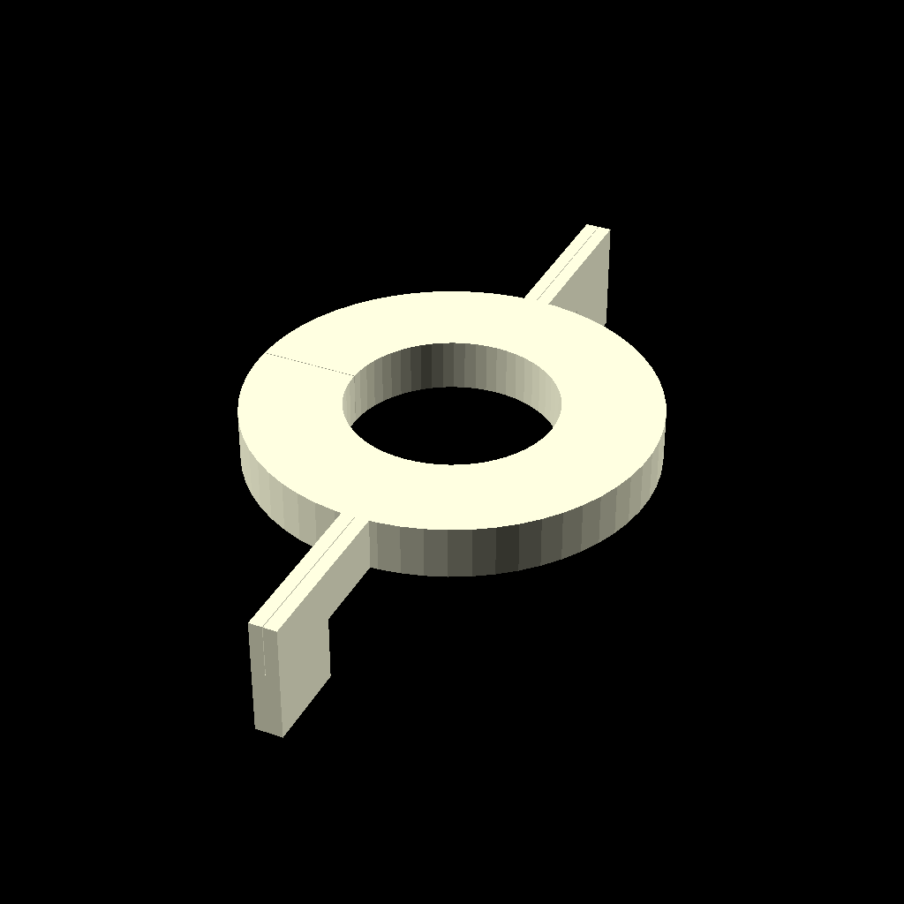

<!-- README.md is generated from README.Rmd. Please edit that file -->

# 3D printed µLogger parts

## Device

## Adapter Balch

## Adapter Culture60

## Adapter Gl45

## Adapter Hungate

## Adapter Serum120

## Adapter Serum160

## Adapter Serum60

## Base Adapter Culture60

## Base Bottle Adapter

## Light Adapter Down

## Light Adapter Up

## Stirrer

